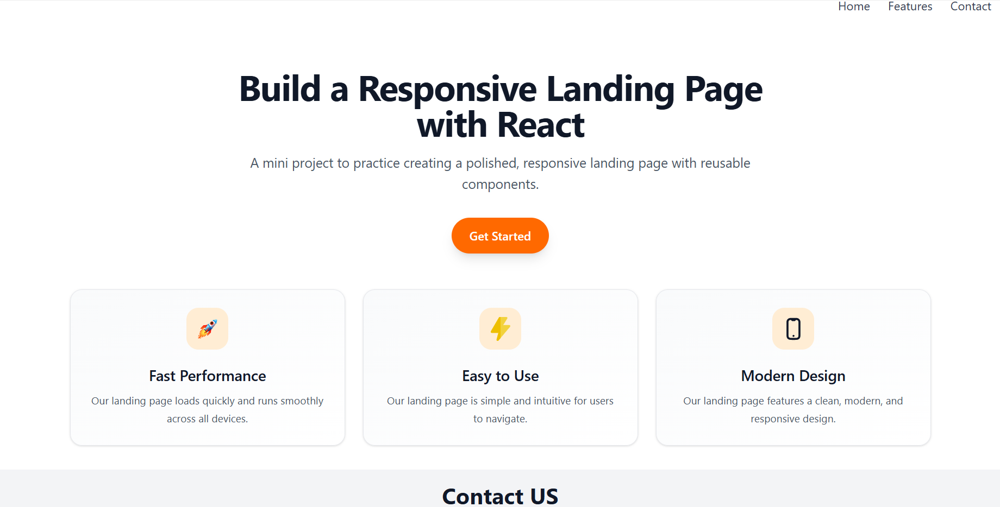

# Mini Project Landing Page

This project is a simple React + Vite landing page built as a mini practice exercise. It includes a responsive header, a hero section, feature cards, and a contact area styled with Tailwind CSS.

## Features

- Responsive layout for desktop and mobile screens
- Clean and modern landing page design
- Reusable React components
- Tailwind CSS styling for fast UI development

## Project Structure

- src/App.jsx - Main app component
- src/Header.jsx - Navigation header
- src/Card.jsx - Hero section and feature cards
- src/Contact.jsx - Contact form section

## Installation

1. Navigate to the project folder
2. Install dependencies:
   ```bash
   npm install
   ```
3. Start the development server:
   ```bash
   npm run dev
   ```

## UI Preview

A preview image placeholder is available here for the final interface screenshot:



## Technologies Used

- React
- Vite
- Tailwind CSS
